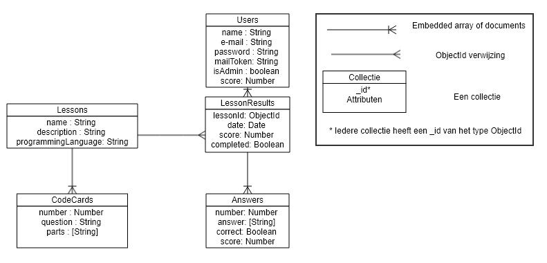
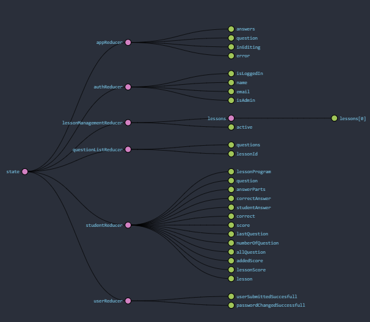
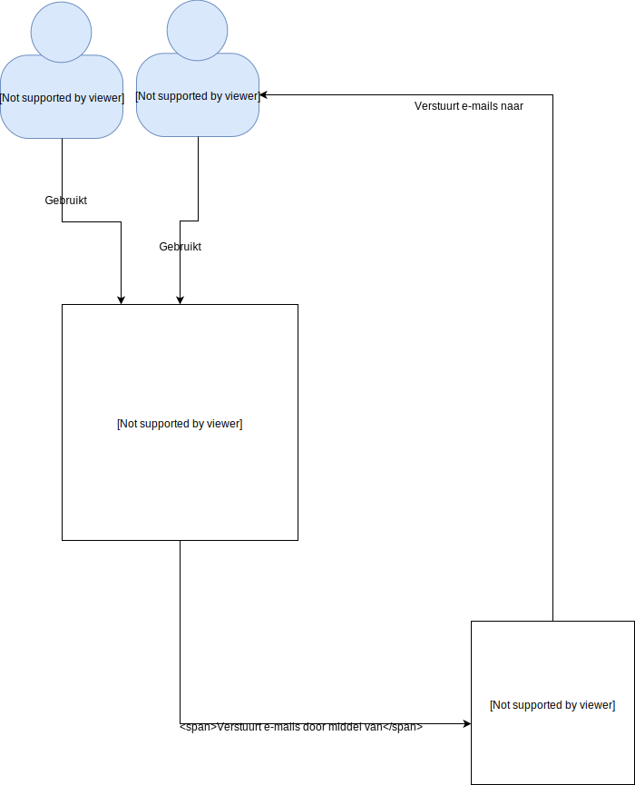
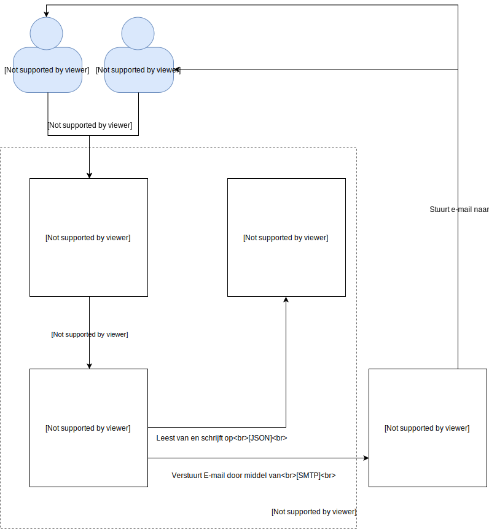
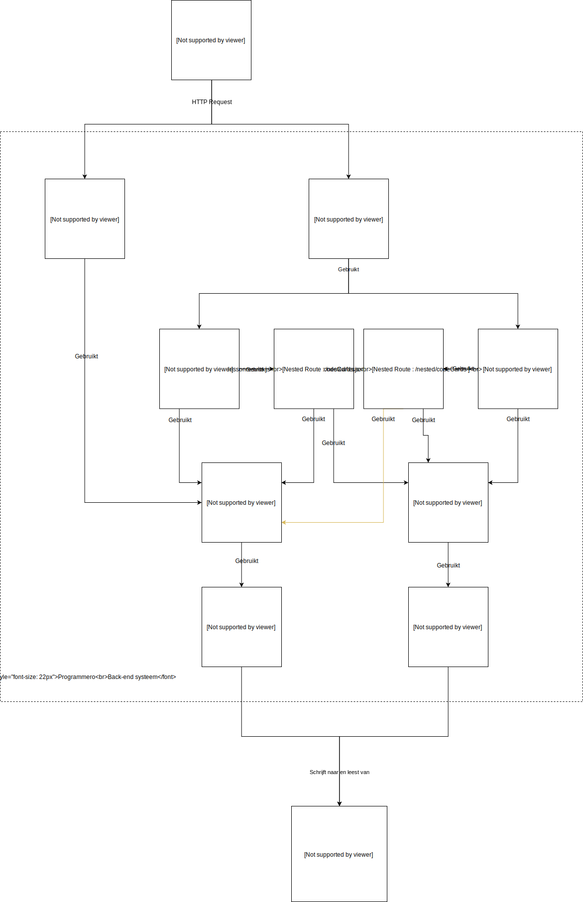

# Introductie
Dit software guidebook zal inzicht geven op vele aspecten van de volledige Programmero applicatie. De hoofdstukken zijn opgedeeld over verschillende bestanden in de map `documentation/Software Guidebook/chapters` aan de hand van een [website](https://leanpub.com/techtribesje/read#introduction) en de inhoudsopgave van het boek dat op de website wordt aangegeven. Daarbij heeft de projectgroep het hoofdstuk "REST endpoints" toegevoegd omdat we deze documentatie belangrijk vinden en het een toevoeging heeft voor het software guidebook en de gebruikers en administrators van Programmero. Het hoofdstuk "Implementatie" is weggehaald in het SGB omdat deze is gedocumenteerd in de `Readme.md` van dit project.

Om een duidelijke focus te leggen op wat het software guidebook te documenteren heeft zullen we dit samenvatten in een paar punten:
- De context, probleem en oplossing van de applicatie
- De requirements, limitaties en principes van de applicatie
- Een overzicht van de mogelijkheden die de backend van de applicatie bied in de format van REST endpoints
- De software architectuur van de applicatie op beide hoog niveau en in detail
- Infrastructuur van de applicatie
- Onderhoud en ondersteuning na implementatie van de applicatie

# Context
In dit hoofdstuk zal de context van de applicatie Programmero worden gedocumenteerd. Dit hoofdstuk is erg belangrijk om de intentie en motivatie van het probleem in te zien. In het volgende hoofdstuk zal worden ingegaan hoe dit probleem in zijn geheel wordt opgelost met de applicatie.

## Probleemstelling
Programmero is een applicatie die docenten van de HAN (hogeschool van Arnhem -en Nijmegen) een nieuwe manier van het vak SPD geven zou moeten aanbieden. Docenten hebben hierbij aangegeven dat bepaalde studenten die het vak SPD volgen, soms niet goed kunnen meegaan in de lessen. De docenten van de HAN hebben onderzoek gedaan naar lesmethoden die anders zijn om zo de studenten te helpen die moeite hebben om het huidige lesprogramma te volgen. 

De huidige lesmethode valt onder het "whole-word" principe. Hierbij worden hele woorden gebruikt om programmeertalen uit te leggen en te oefenen.  Hierbij wilt de productowner een applicatie hebben die een "phonix" principe aanpakt. Het "phonix" principe bied een lesstijl aan die een taal en grammatica opdelen in kleine stukken ophakt en daarin vragen kan neerzetten om mee te oefenen. Hiermee kan de productowner deze lesmethode aan zijn studenten aanbieden als ze moeite hebben met het "whole-word" principe in de lessen?

## Uitwerking
Het doel van de applicatie is:
- Een unieke applicatie neer te zetten voor studenten om nieuwe leermethodiek te promoten
- Vragen en lesprogramma's aanbied voor studenten die in deze leeromgeving moeten oefenen met een programmeertaal
- Docenten de macht geven om lesprogramma's en vragen te beheren

Het product zal bestaan uit twee onderdelen: de backend die alle aanvragen behandeld en die toegang heeft tot de database. En de React frontend die kan worden bezocht door gebruikers en door studenten en docenten kan worden gebruikt. Deze twee onderdelen vormen samen de applicatie.

## Gebruikers
Programmero heeft drie typen gebruikers:
- Anonieme gebruiker
- Student
- Docent

Elk van deze gebruikers zal nog worden toegelicht onder hoofdstuk 3: functionele overview

# Functioneel overzicht
Dit hoofdstuk zal ingaan op alle inhoud die in de applicatie van Programmero zit. Dit gaat over informatie die de applicatie geeft, maar ook functionaliteit die de applicatie aanbied om zijn doel te bereiken.

## Lesprogramma's en codekaarten
Programmero bestaat uit:
- Lesprogramma - een lesprogramma is een lijst van codekaarten die:
	- De programmeertaal en structuur van een lesprogramma definiëren
	- Een oefening neerzet voor studenten
- Codekaart - een entiteit die uit de volgende onderdelen bestaat:
	- Een vraag gekoppeld aan de programmeertaal van het lesprogramma
	- Een antwoord die in phonix stijl is geformuleerd
- Score - Een visuele representatie van de score van een student of lesprogramma resultaten
- Student - Gebruiker die oefeningen kan doen op lesprogramma's die door een docent zijn gemaakt en daardoor punten kan scoren
- Docent - Gebruiker die lesprogramma's en codekaarten binnen een lesprogramma beheert

Binnen Programmero zijn lesprogramma's en codekaarten de kern van de applicatie. Een lesprogramma is een lijst van codekaarten die een docent kan aanmaken. Een student kan aan de hand van een lesprogramma vervolgens codekaarten invullen om het lesprogramma te voltooien en zo een oefening te voldoen. Daarbij kan de student bij elke oefening een score behalen.

## Gebruikers
#### Anonieme gebruikers
Anonieme gebruikers representeren alle gebruikers die geen account of inloggegevens hebben. Anonieme gebruikers kunnen niet in de applicatie komen en kunnen alleen het inlogscherm zien.

#### Student gebruiker
Student gebruikers representeren alle gebruikers die een account hebben met studentfunctionaliteit. Dit houdt in dat ze oefeningen kunnen maken van de lesprogramma's die in de applicatie staan en hier een score mee kunnen behalen.
Een student kan aan de hand van informatie die een leraar heeft een email ontvangen om een account te activeren.

#### Docent gebruiker
Docent gebruikers representeren gebruikers die een administrator account hebben. Hierbij kunnen docenten lesprogramma's en codekaarten aanmaken om ervoor te zorgen dat studenten kunnen oefenen aan deze lesprogrammas's. Ook kan een leraar een gebruiker toevoegen aan het systeem door een email en naam in te voeren. Vervolgens kan deze gebruiker een eigen wachtwoord invoeren.

## Gamificatie
In de applicatie is een vorm van gamificatie ingebouwd. Dit is een een basisvorm geïmplementeerd door een score per student, lesprogramma en vraag te berekenen. Deze scores kunnen vergeleken worden met studenten zodat er een competitieve omgeving kan worden gecreëerd. In de toekomst kan er ook op deze basis een competitieve vorm worden gemaakt waarin een student een andere student kan uitdagen in een in-app competitieve omgeving. Deze functionaliteit is uitgeschreven in [userstory 4](https://github.com/HANICA-DWA/sep2018-project-aardvark/issues/5).

# REST API reference

Dit hoofdstuk zal alle REST endpoints documenteren. Dit is zodat er een duidelijk overzicht is voor developers om te zien waar ze informatie kunnen halen, geven, aanpassen en verwijderen. De REST backend server gebruikt Node.JS en heeft MongoDB en ExpressJS geïnstalleerd staan. 

Alle inkomende aanvragen (requests) moeten met JSON worden aangevraagd. Hierbij moet er gebruik gemaakt worden van MIME-type "application/json" in de HTTP request header.

Het returntype van elk endpoint in de server is JSON. Hierbij zal het MIME-type "application/json" in de HTTP header worden meegegeven.

## Authenticatie

| Methode | Pad | Body/Payload | Omschrijving | Response |
|---------|-----|------|--------------|----------|
| GET | /auth/:mailToken/check | - | Checkt of een mailtoken van een gebruiker bestaat | HTTP 200: String <br> HTTP 400: Object |
| POST | /auth/login | `email: String`<br> `password: String` | Logt een gebruiker in op basis van gegeven email en password | HTTP 200: Webtoken <br> HTTP 422: Object <br> HTTP 500: Object |
| POST | /auth/secret | `mailToken: String` <br> `pass: String` <br> `passrepeat: String` | Valideert wachtwoord en zet een wachtwoord voor de gebruiker met aangegeven mailtoken | HTTP 200: No content <br> HTTP 400: Object |

## Lesprogramma's

| Methode | Pad | Body/Payload | Omschrijving | Response |
|---------|-----|------|--------------|----------|
| GET | /lessons | - | Geeft alle lesprogramma's terug | HTTP 200: Array<br> HTTP 401: Object <br> HTTP 500: Object |
| GET | /lessons/:lessonId | - | Geeft een specifiek lesprogramma terug op basis van het meegegeven ID | HTTP 200: Object <br> HTTP 401: Object <br> HTTP 422: Object <br> HTTP 404: Object <br>  HTTP 500: Object |
| POST | /lessons | `name: String`<br>`description: String` <br> `programmingLanguage: String` | Maakt een nieuw lesprogramma aan de hand van meegegeven POST gegevens | HTTP 201: Object <br/> HTTP 401: Object <br/> HTTP 422: Object <br>  HTTP 500: Object |
| PUT | /lessons/:lessonId | `name: String`<br>`description: String`<br>`programmingLanguage: String` | Past een bestaand lesprogramma aan aan de hand van meegegeven PUT gegevens | HTTP 200: Object <br> HTTP 401: Object <br/> HTTP 422: Object <br>  HTTP 500: Object |
| DELETE | /lessons/:lessonId | - | Verwijderd een specifiek lesprogramma op basis van het meegegeven ID | HTTP 204: No Content <br> HTTP 401: Object <br/> HTTP 422: Object <br>  HTTP 500: Object |

## Codekaarten

| Methode | Pad | Body/Payload | Omschrijving | Response |
|---------|-----|------|--------------|----------|
| GET | /lessons/:lessonId/codecards | - | Geeft alle codekaarten van een specifiek lesprogramma op basis van meegegeven ID | HTTP 200: Array <br> HTTP 401: Object <br> HTTP 404: Object <br> HTTP 422: Object  <br>  HTTP 500: Object |
| GET | /lessons/:lessonId/codecards/:codecardId | - | Geeft een specifieke codekaart in een lesprogramma terug op basis van meegegeven IDs | HTTP 200: Object<br> HTTP 401: Object <br> HTTP 404: Object <br> HTTP 422: Object <br>  HTTP 500: Object |
| GET | /lessons/:lessonId/codecards/student | - | Geeft een codekaart in een lesprogramma terug op basis van meegegeven ID en lessonresult dat de student heeft Zorgt ervoor dat het antwoord door elkaar gehusseld is | HTTP 200: Object<br> HTTP 401: Object <br> HTTP 404: Object <br> HTTP 409: Object <br> HTTP 422: Object <br>  HTTP 500: Object |
| POST | /lessons/:lessonId/codecards | `question: String`<br> `answer: [String]` | Maakt een nieuwe codekaart in een lesprogramma aan de hand van meegegeven POST gegevens en ID | HTTP 201: Object <br/> HTTP 401: Object <br> HTTP 404: Object <br> HTTP 422: Object <br>  HTTP 500: Object |
| PUT | /lessons/:lessonId/codecards/:codecardId | `question: String`<br> `answer: [String]` | Past een bestaande codekaart in een lesprogramma aan aan de hand van meegegeven PUT gegevens en IDs | HTTP 200: Object <br> HTTP 401: Object <br> HTTP 404: Object <br> HTTP 422: Object <br>  HTTP 500: Object |
| DELETE | /lessons/:lessonId/codecards/:codecardId | - | Verwijderd een specifieke codekaart in een lesprogramma op basis van het meegegeven ID | HTTP 204: No content <br> HTTP 401: Object <br> HTTP 404: Object <br> HTTP 422: Object <br> HTTP 500: Object |

## Oefenresultaten

| Methode | Pad | Body/Payload | Omschrijving | Response |
|---------|-----|------|--------------|----------|
| GET | /users/lessonresult/:lessonId/end | - | Haalt oefenresultaten op van laatste oefening die in een les is gemaakt op basis van meegegeven ID | HTTP 200: Object <br> HTTP 401: Object <br> HTTP 404: Object <br> HTTP 422: Object <br>  HTTP 500: Object |
| POST | /users/lessonresult/:lessonId | - | Maakt een nieuwe lessonresult, zodat een student met een oefening kan beginnen | HTTP 201: Object <br> HTTP 401: Object <br> HTTP 404: Object <br> HTTP 422: Object <br>  HTTP 500: Object |
| POST | /users/lessonresult/:lessonId/answer | `answer: [String]`<br>`index: Int` | Voegt een nieuw antwoord toe aan een lessonresult | HTTP 200: Object <br/> HTTP 401: Object <br> HTTP 404: Object <br> HTTP 422: Object <br> HTTP 500: Object |


## Gebruikers

| Methode | Pad | Body/Payload | Omschrijving | Response |
|---------|-----|------|--------------|----------|
| GET | /users/score | - | Vraagt de totaalscore van een gebruiker op | HTTP 200: Number <br> HTTP 401: Object <br> HTTP 500: Object |
| GET | /users/score/:lessonid | - | Vraagt de score van een specifieke les van een gebruiker op | HTTP 200: Number <br> HTTP 401: Object <br> HTTP 404: Object <br> HTTP 422: Object <br> HTTP 500: Object |
| POST | /users | `name: String` <br> `email: String`<br> `isAdmin: Boolean` | Maakt een nieuwe user aan en stuurt een mail naar naar de desbetreffende user | HTTP 201: No content <br> HTTP 400: Object <br> HTTP 422: Object <br> HTTP 500: Object |

# Data structure
In dit hoofdstuk van het softwareguidebook wordt het ERD en de datastore van Redux beschreven.

#### ERD



In het bovenstaande diagram wordt het entity relationship model getoond. In dit diagram wordt alle informatie die in de database wordt opgeslagen gemodeleerd. We hebben dit database model gemodelleerd aan de hand van document georienteerde manier (MongoDB).

In dit model zijn er twee collecties gemodelleerd met schema's die embedded in deze collecties staan. We hebben deze twee collecties aan elkaar gekoppeld aan de hand van lessonId in een lessonresult. Zo kan je altijd een lesresultaat vinden aan de hand een les.


#### Redux data diagram



Er zijn in totaal 6 reducers gemaakt. De afbeelding hierboven is de initiële staat van de store bij de startpagina.

# Kwaliteit attributen
In dit hoofdstuk zullen kwaliteitsattributen van de Programmero applicatie beschreven worden. 

## Prestatie
De snelheid waarmee de applicatie op dit moment werkt is niet te berekenen aangezien deze lokaal wordt gedraaid. Dit is dus afhangend van de CPU die lokaal draait. In hoofdstuk 10 van dit software guidebook is een installatie gedaan op de NAS die niet representatief is voor een normale hosting die gedaan kan worden.

De laadtijd die is vastgesteld op de lokale omgeving is onder de 1 seconde.
De laadtijd die is vastgesteld op de NAS is 15 seconden.

## Veiligheid
De drie gebruikers die bij functioneel overzicht staan beschreven staan allemaal afgeschermd van elkaar in een eigen omgeving. We maken hier gebruik van JWT, een codebibliotheek die, wanneer je inlogt, een token bewaard in de localstorage van de client. Voor elke request die naar de server wordt gestuurd wordt deze token meegestuurd en vergeleken in de backend van de applicatie.

## Internationalisatie
De applicatie maakt alleen gebruik van Nederlandse taal en teksten. Er is geen rekening gehouden met meerdere talen ondersteuning.

## Compatibiliteit
De Programmero appplicatie is gemaakt voor mobiele form factor. De applicatie zal als je de applicatie op je mobiel bezoekt zich aanpassen op de resolutie van het scherm van de client.

De Programmero appplicatie werkt stabiel op de volgende browsers:
1. Google Chrome
2. Mozilla Firefox
3. Internet Explorer 8 (en nieuwere versies)

# Limitaties
In dit hoofdstuk worden alle limitaties waar we in dit project tegenaan lopen neergezet. 

#### Tijd
Programmero wordt gerealiseerd in 8 weken tijd waarvan er 6 weken verdeeld zijn over 3 sprints. De overige twee weken zijn verdeeld in pre-game en post-game voor voorbereiding en afwerking.

#### Budget
Er is geen budget vastgesteld voor geen enkel onderdeel van de applicatie. Hierbij is het dus niet mogelijk om de applicatie te hosten of externe betaalde tools te gebruiken om de applicatie te realiseren. 

Dit betekent ook dat de applicatie geen gebruik kan maken van betaalde licenties van andere software, bibliotheken of frameworks.

#### Kennis
Projectgroep aardvark bestaat uit 5 studenten die aan het begin van hun studie zitten (2e jaars). Hierbij is er een limitatie van kennis in de verschillende elementen van de applicatie en zijn technologieën. Er kan geen aansprakelijkheid worden gesteld aan de studenten voor ongedocumenteerde problemen van de applicatie.

# Principes

## Configuratie
Configuratie is af en toe een lastig aspect van software ontwikkeling. Om alles op te zetten is ons eerste principe dan ook de configuratie die je moet hebben om de applicatie correct te laten werken, maar ook om bijvoorbeeld testing te laten werken.

Voor configuratie gebruiken we dotenv. Een bibliotheek die we in de `programmero-backend` en `e2e` folder gebruiken om desbetreffende artifacts op te zetten. We gaan ervan uit dat de sleutels die in de `.env.example` zelf ingevuld kunnen worden om de juiste lokale of remote configuratie de applicatie werkend te krijgen. Dit doe je door de `.env.example` te kopieëren en `.env` aan te maken en de juiste gegevens in te vullen. De bedoeling voor `programmero-backend` is hier dat je twee MongoDB databases hebt (een voor productie en een voor testing), app variabelen, een JWT secret key die je kan aamaken in `programmero-backend/scripts/createUserPassword.js` en SMPT gegevens voor de mailing.

## Geautomatiseerd testen
Een van de andere principes die we willen hanteren is het gebruik van unit tests en end-to-end tests. Hierbij wordt er een aparte omgeving neergezet waar de functionaliteiten van het opgezette artifact worden getest. Met een end-to-end test worden geen individuele functies getest, maar wordt de applicatie doorlopen in een automatische computergestuurde browser die door de applicatie klikt om onderdelen te testen die op elkaar werken volgens een bepaalde volgorde.

### Unit tests
Het gebruik van unit testing is om te blijven checken of functies die zijn gemaakt werken zoals ze ontworpen zijn. We testen hierbij functies en classes van verschillende onderdelen van de app in beide backend en frontend.

Om de tests correct uit te voeren moeten er de volgende commando's uitvoerd worden voor hun respectievelijke artifacten.

**Backend**
```
$ cd programmero-backend
$ npm i
$ npm test -- --runInBand --silent
```

**Frontend**
```
$ git checkout unittests/frontend
$ cd programmero-frontend
$ npm i
$ npm test
```

### End-to-end tests
End-to-end testing is het principe van een UI test die automatisch door de applicatie heen klikt en zo alles test.

```
$ cd e2e
$ npm i
$ npm start
```

# Software architectuur

## Context diagram


In dit bovenstaande diagram is de context van het Programmero syteem getekend. Hier zijn alle systemen waar de eindgebruiker van de applicatie interactie mee heeft om de applicatie in zijn geheel te laten werken. 

## Container diagram


Dit container diagram is een visuele representatie van het hele Programmero systeem. Hier zijn alle interne en externe onderdelen van de applicatie weergegeven om een duidelijk beeld te krijgen hoe elk onderdeel van de applicatie met elkaar werkt op een macro grootte.

* Web applicatie: Een met React, Redux en Javascript gemaakte front-end website waarop gebruikers acties kunnen uitvoeren.
* Web server: Een Javscript, Express en mongoDB server dat de enige plek is waar gebruikers via het Internet het systeem kunnen bereiken.
* Database: Een MongoDB/Mongoose database die Programmero gebruikt om data op te slaan.
* Mail server: Een Mailtrap.io server die gebruikt wordt om emails vanaf het systeem naar de gebruikers te sturen.

## Component Front-end diagram
Dit diagram toont de relatie tussen alle componenten binnen het front-end systeem van Programmero.

### __Let op:__
* Redux Reducers komen vaker voor en staan aangegeven per kleur. Dit is gedaan omdat meerdere React componenten bepaalde Reducers gebruiken.
* Redux Actions staan niet in het diagram omdat het heel erg lastig is om deze duidelijk te tonen. Een React component kan bijvoorbeeld zonder action bij een reducer data ophalen, maar hij kan ook via een action data schrijven naar een reducer. Onder het diagram staat per React component beschreven welke action deze gebruikt.


Dit frontend component diagram laat de gehele werking van de frontend React componenten zien. Frontend bestaat uit 3 begrippen: components, action creators en reducers met elk hun eigen functionalteit. Hierbij zijn:
- Components: User Interface React elementen die onderdelen van de applicatie renderen en acties kunnen uitvoeren.
- Action creators: Worden door components beheerd en aangeroepen, veranderen de state van Redux door reducers aan te roepen.
- Reducers: Functies die informatie uitsluiten.

#### Action creators per  React Component:
* AddQuestion.jsx gebruikt actionCreator(s): questionManagementAction, lessonManagementAction.
* AddPassword.jsx gebruikt actionCreator(s): userActions.
* InviteUser.jsx gebruikt actionCreator(s): userActions.
* LessonManagement.jsx gebruikt actionCreator(s): lessonManagementAction.
* Login.jsx gebruikt actionCreator(s): userActions.
* QuestionEdit.jsx gebruikt actionCreator(s): questionManagementAction, lessonManagementAction.
* QuestionManagement.jsx gebruikt actionCreator(s): questionManagementAction, lessonManagementAction.
* Feedback.jsx gebruikt actionCreator(s): practiceAction, questionManagementAction.
* LessonprogramResult.jsx gebruikt actionCreator(s): userActions.
* Practice.jsx gebruikt actionCreator(s): questionManagementAction, practiceAction.
* StudentProgramms.jsx gebruikt actionCreator(s): practiceAction, questionManagementAction, lessonManagementAction.

## Component Back-end diagram
Dit diagram toont de relatie tussen alle componenten binnen het back-end systeem van Programmero.

### __Let op:__
* Iedere Route gebruikt validationCheckers.js.



Dit laatste component diagram laat de gehele werking van de backend onderdelen zien. Backend bestaat uit 3 begrippen: Routes, models en middleware met elk hun eigen functionalteit. Hierbij zijn:
- Routes: alle REST endpoints van de server. Hier staan alle URLs waar de frontend van de applicatie aanvragen naar kan versturen.
- Models: de enige functies die toegang hebben tot de database. Deze worden gebruikt in de routes om controle te hebben over de collecties die er in de database staan.
- Middleware: alle functies die voor een request worden uitgevoerd. De enige middleware die we gebruiken is een authorisatie middleware die kijkt of een gebruiker is ingelogd en zet een sessie in de request zelf.

# Infrastructure architectuur
In dit hoofdstuk worden de specificaties van de server waarop programmero kan draaien gedocumenteerd, Programmero is succesvol getest op een NAS, aan de hand hiervan zijn de minimum systeemeisen opgesteld.

#### Minimale specificaties

| Specificatie         | Waarde                   |
| -------------------- | ------------------------ |
| Modelnaam            | DS216+                   |
| CPU                  | INTEL Celeron N3050      |
| Kloksnelheid van CPU | 1.6 GHz                  |
| CPU-kernen           | 2                        |
| Fysiek geheugen      | 1024 MB                  |
| Operating system     | DSM 6.2.1-23824 Update 4 |

De setup is getest door node, git en npm te installeren. MongoDB draait als een container in een virtuele omgeving, vooral het opstarten van deze software is zwaar. Om deze reden is er geen deamon aangemaakt op de nas.

Op een server met gelijkwaarde specificaties kan Programmero draaien, dit raad het Aardvark team af. In deze omgeving wordt de deployment omgeving gezet. Omdat dit een hobby project is worden er geen credentials en procedures vrij gegeven, dit heeft te maken met non disclosure en veiligheid. Zie hoofdstuk aangeraden specificaties en installatie handleiding voor uitgebreidere installatieinstructies.

#### Aangeraden specificaties

| Specificatie         | Waarde                                                       |
| -------------------- | ------------------------------------------------------------ |
| CPU                  | Processorarchitectuur AMD64 (een 64 bit AMD of Intel processor) |
| Kloksnelheid van CPU | 3 Ghz of meer                                                |
| CPU-kernen           | 4                                                            |
| Fysiek geheugen      | 4GB of meer                                                  |
| Operating system     | Ubuntu 18.04.1 LTS Bionic (Meest recente LTS versie is ook goed) |

# Onderhoud en ondersteuning
Dit hoofdstuk beschrijft alle acties die na de voltooiing van het project uitgevoerd worden en welke niet. 

## Onderhoud
Onderhoud van dit product valt niet onder de verantwoordelijkheid van de eerste projectgroep (Aardvark). Maar valt onder de opdracht van de productowner waar het product aan overhandigd is. De productowner kan aan de hand van gemaakte documentatie en applicatie het project hosten en/of overhandigen aan een andere projectgroep. 

Projectgroep Aardvark is wel verantwoordelijk voor documentatie rond overhandiging van de applicatie. Dit betekent dat de projectgroep een zo'n goed mogelijke visuele en tekstuele representatie van de applicatie in beeld kunnen schetsen in het installatie handboek, dit software guide book en het PvA. Dit is zodat toekomstige projectgroepen de applicatie beter kunnen analyseren, sneller kunnen testen en wijzigingen kunnen toevoegen.

## Ondersteuning
Dit product krijgt van de eerste projectgroep (Aardvark) geen verdere ondersteuning na de projectperiode van 8 weken. Deze ondersteuning houdt in: er zullen geen extra functionaliteiten, bug fixes, issues, userstories of projectborden worden aangemaakt, aangepast of bijgehouden.