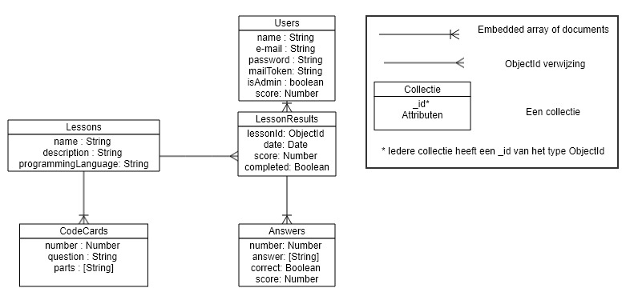
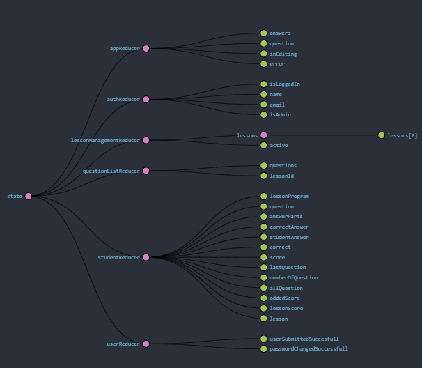

# Data structure
In dit hoofdstuk van het softwareguidebook wordt het ERD en de datastore van Redux beschreven.

#### ERD

In het bovenstaande diagram wordt het entity relationship model getoond. In dit diagram wordt alle informatie die in de database wordt opgeslagen gemodeleerd. We hebben dit database model gemodelleerd aan de hand van document georienteerde manier (MongoDB).

In dit model zijn er twee collecties gemodelleerd met schema's die embedded in deze collecties staan. We hebben deze twee collecties aan elkaar gekoppeld aan de hand van lessonId in een lessonresult. Zo kan je altijd een lesresultaat vinden aan de hand een les.

#### Redux data diagram

Er zijn in totaal 6 reducers gemaakt. De afbeelding hierboven is de initiële staat van de store bij de startpagina.